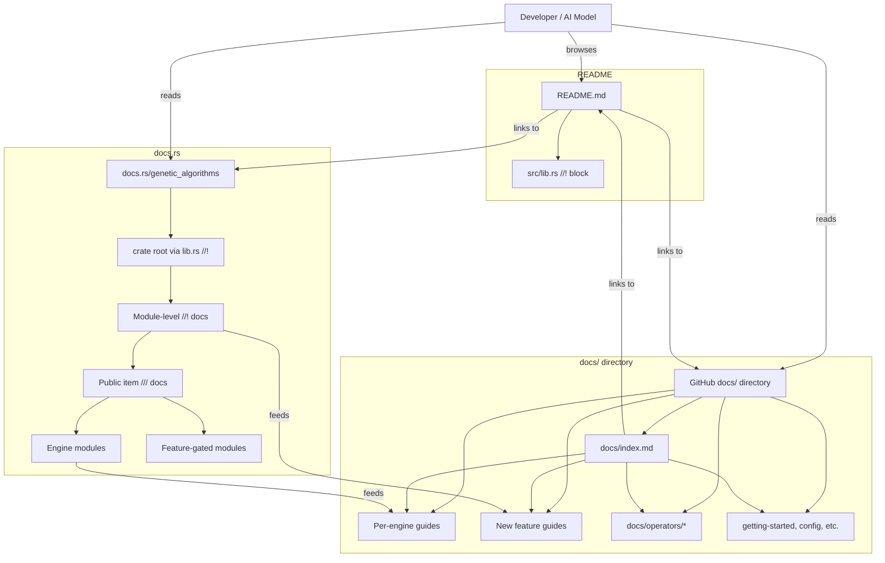

# Phase 46: Documentation Refactor — Research

**Researched:** 2026-05-14
**Domain:** Rust crate documentation (rustdoc, markdown, README)
**Confidence:** HIGH

## Summary

Phase 46 is a pure documentation phase: no code changes, no API changes, no new features. The goal is to produce comprehensive, production-quality documentation serving as a Single Source of Truth (SSOT) for both human developers and AI models. The library has grown from 7 to 11 engines and from 10 to 19 examples since the last documentation phase (Phase 12, March 2026), and the existing documentation lags substantially behind.

**Current state:** The `docs/` directory has 20 files (15 root + 5 operators/), but these reference an older API (`ga_lib` crate), list only 7 of 11 engines, and are missing documentation for 18+ key topics (constraints, HOF, AOS, benchmarks, NSGA-III, MOEA/D, SPEA2, SMS-EMOA, IBEA, memetic, observer, operations, niching, extension, error, initializers, multi_objective). The `src/lib.rs` doc block is only 52 lines and doesn't reference 5 of 11 engines. The README lists only 10 of 19 examples and 7 of 11 engines.

**Deliverable scope:** (1) Rewrite `src/lib.rs` doc block as comprehensive crate documentation, (2) Update 20 existing `docs/` files, (3) Create 18+ new `docs/` files, (4) Expand README to cover all engines/examples/features, (5) Expand module-level `//!` docs for all 11 engines with "ficha tecnica" per D-04, (6) Add `///` rustdoc to all public items, (7) Add inline doc comments to all 19 examples.

**Primary recommendation:** Structure the work in 5 waves, ordered by dependency: Base Layer (lib.rs + README + docs/index) -> Per-Engine Docs -> New Feature Docs -> Existing Doc Updates -> Rustdoc Coverage & Examples.

## Architectural Responsibility Map

| Capability | Primary Tier | Secondary Tier | Rationale |
|------------|-------------|----------------|-----------|
| Crate-level docs (docs.rs) | Rustdoc (`//!` in lib.rs) | — | docs.rs reads only the crate root; this is the AI/human entry point |
| GitHub-facing guides | `docs/` directory | README links | README links to `docs/`; humans browse README then drill into guides |
| Per-engine algorithm docs | Engine `//!` doc (source) | `docs/{engine}.md` guide | D-01/D-02: hybrid approach — source for docs.rs, file for GitHub |
| Public API reference | Rustdoc `///` on items | — | Generated by `cargo doc`, consumed via docs.rs |
| Feature documentation | Inline in `//!` block | Feature flag tables | Feature-gated items need conditional doc annotations |
| README catalog | README.md | — | Marketing surface; must cover all engines, examples, features |
| Example documentation | Inline comments in `examples/*.rs` | README examples table | Users read examples as runnable entry points |

## Standard Stack

### Core
| Library | Version | Purpose | Why Standard |
|---------|---------|---------|--------------|
| Rustdoc | bundled with Rust toolchain | Generate HTML crate documentation | The only option for crate-level API docs in Rust |
| Markdown | N/A | Guide files in `docs/` | README and GitHub rendering expect standard markdown |
| `cargo doc` | bundled with Cargo | Build and verify documentation | `cargo doc --no-deps` detects broken links and warnings |

### Supporting
| Library | Version | Purpose | When to Use |
|---------|---------|---------|-------------|
| `#[doc]` attributes | Rust standard | Custom doc metadata, `#[doc(hidden)]`, `#[doc(cfg)]` | Feature-gated items need `#[doc(cfg(feature = "..."))]` |
| `#[forbid(missing_docs)]` | Rust standard | Enforce documentation completeness | New modules to prevent doc gaps |
| Backtick code fences | N/A | Runnable examples in rustdoc | Verified with `cargo test --doc` |
| `// ...` elision | N/A | Abbreviated examples | D-11 explicitly forbids: "No abbreviated or truncated examples in public docs" |
| Intra-doc links | Rustdoc syntax | Cross-reference between items | `[`Ga`](crate::ga::Ga)` style links for navigation |

### Alternatives Considered
| Instead of | Could Use | Tradeoff |
|------------|-----------|----------|
| Plain markdown in `docs/` | mdBook | mdBook generates standalone HTML with search/nav, but adds build step and diverges from `cargo doc` output. D-03 explicitly says "no mdBook unless explicitly requested" |
| `///` on all items | `#[forbid(missing_docs)]` | `forbid` is too aggressive for a large crate; gradual coverage is better |

**Version verification:**
- Rust toolchain: `rustc 1.81.0` (per Cargo.toml `rust-version`)
- cargo doc: bundled with above — verify with `cargo doc --no-deps`

## Architecture Patterns

### System Architecture Diagram



**Data flow:** The user enters through one of three entry points (README, docs.rs, GitHub docs/). Each entry point links to the others. The SSOT principle requires that any of the three paths leads to complete information — no content exists in only one path without referral paths from the others.

### Recommended Project Structure (docs/ directory)

```
docs/
├── index.md                           # Navigation hub (MISSING — CREATE)
├── getting-started.md                 # EXISTING — update for API correctness
├── ARCHITECTURE.md                    # EXISTING — update engines list 7->11
├── api-reference.md                   # EXISTING — update for new modules
├── configuration.md                   # EXISTING — verify accuracy
├── chromosomes.md                     # EXISTING — verify accuracy
├── genotypes.md                       # EXISTING — verify accuracy
├── traits.md                          # EXISTING — verify accuracy
├── fitness.md                         # EXISTING — verify accuracy
├── population.md                      # EXISTING — verify accuracy
├── validators.md                      # EXISTING — verify accuracy
├── DEVELOPMENT.md                     # EXISTING — verify accuracy
├── TESTING.md                         # EXISTING — verify accuracy
├── examples.md                        # EXISTING — REWRITE (uses old ga_lib API, only 2 examples)
├── engines.md                         # EXISTING — EXPAND to all 11 engines
├── operators/
│   ├── selection.md                   # EXISTING — update (uses old ga_lib, missing Clearing)
│   ├── crossover.md                   # EXISTING — update (missing Edge Recombination, Differential)
│   ├── mutation.md                    # EXISTING — update (missing Cauchy, Levy, Uniform, NonUniform)
│   ├── survivor.md                    # EXISTING — update (missing Deterministic Crowding)
│   └── extension.md                   # EXISTING — verify accuracy
│
├── nsga3.md                           # MISSING — CREATE (per-engine guide)
├── moead.md                           # MISSING — CREATE
├── spea2.md                           # MISSING — CREATE
├── sms_emoa.md                        # MISSING — CREATE
├── ibea.md                            # MISSING — CREATE
├── multi_objective.md                 # MISSING — CREATE (shared indicators + quality metrics)
├── observer.md                        # MISSING — CREATE (GaObserver system)
├── constraints.md                     # MISSING — CREATE
├── hall_of_fame.md                    # MISSING — CREATE
├── aos.md                             # MISSING — CREATE (adaptive operator selection)
├── benchmarks.md                      # MISSING — CREATE (feature-gated)
├── memetic.md                         # MISSING — CREATE (depends on Phase 45)
├── operations.md                      # MISSING — CREATE (overview of all operator categories)
├── niching.md                         # MISSING — CREATE
├── extension.md                       # MISSING — CREATE
├── error.md                           # MISSING — CREATE
└── initializers.md                    # MISSING — CREATE
```

### Pattern 1: Per-Engine Ficha Tecnica Template (D-04)
**What:** Each engine guide in both `//!` doc and `docs/{engine}.md` follows a consistent template with all D-04 requirements.
**When to use:** Every engine module doc and every engine guide file.
**Template:**
```markdown
# Engine Name

## Description
[Algorithm description and mathematical context — what problem does it solve, how does it work conceptually?]

## When to Use
- **Problem type:** [single-objective / multi-objective / many-objective / continuous / combinatorial]
- **Number of objectives:** [1 / 2+ / 3+]
- **Variable type:** [binary / real-valued / permutation / List<T> / mixed]
- **Population structure:** [single / island / grid / layered / reference set]
- **Key strength:** [What is this engine best at?]
- **Key weakness:** [When should you NOT use this?]

## Quick Reference

### Mandatory Parameters
| Parameter | Type | Default | Description |
|-----------|------|---------|-------------|
| ... | ... | — | ... |

### Optional Parameters
| Parameter | Type | Default | Description |
|-----------|------|---------|-------------|
| ... | ... | ... | ... |

## Complete Example
\```rust,ignore
// A full, compilable example showing the engine from construction to result
// Must compile against the current crate API
\```

## Configuration Tips
- [Tip 1 about tuning parameters]
- [Tip 2 about common mistakes]
- [Tip 3 about performance]

## When to Choose This vs [Similar Engine]
| Factor | This Engine | [Alternative] |
|--------|------------|---------------|
| [criterion 1] | [behavior] | [behavior] |
| [criterion 2] | [behavior] | [behavior] |

## References
- [Paper/author, year, citation]
```

### Pattern 2: AI-Ready Documentation (D-11)
**What:** Documentation structured for machine consumption — explicit parameter tables, decision guidance, complete examples.
**Requirements:**
- Parameter tables with columns: Name, Type, Required/Optional, Default, Description
- Every example is complete (no `// ...` elisions)
- Decision tables ("when to use engine X vs Y")
- Cross-reference links using intra-doc link syntax: `[`Ga`](crate::ga::Ga)`

### Anti-Patterns to Avoid
- **Abbreviated examples:** D-11 explicitly forbids `// ...` truncation in public docs. Examples must be complete and copiable.
- **Stale API references:** The existing `docs/examples.md` references `ga_lib` crate and old struct names. Must be fully rewritten.
- **Orphaned docs without cross-links:** Every `docs/` file should link to related guides. The index must link to all.
- **Silent version drift:** README and docs/ can diverge from the actual API. Must verify against current source after writing.
- **WSDL warnings:** `cargo doc --no-deps` must produce zero warnings. Cyclic intra-doc links and broken references are the main risk.

## Don't Hand-Roll

| Problem | Don't Build | Use Instead | Why |
|---------|-------------|-------------|-----|
| Documentation generation | Custom doc generator | Rustdoc `//!` + `///` | Rustdoc is the standard; it integrates with docs.rs, supports intra-doc links, and `cargo test --doc` verifies examples |
| Feature-gated doc rendering | Manual `#[cfg]` blocks in docs | `#[doc(cfg(feature = "..."))]` | Attributes render correct feature badges on docs.rs automatically |
| Navigation for docs/ | Manual nav sidebar | `docs/index.md` table of contents | GitHub renders index.md as directory-level page; markdown TOC is sufficient |
| Cross-references | Hardcoded URLs to GitHub files | Intra-doc links (`crate::module::Item`) | Intra-doc links render correctly on docs.rs and don't break on version change |

## Common Pitfalls

### Pitfall 1: Stale docs from rapid feature development
**What goes wrong:** The last 15 phases (30-45) added 4 engines, constraint handling, HOF, AOS, benchmarks, memetic, and 9+ examples. Existing documentation references an older codebase.
**Why it happens:** Documentation phases are rare (last was Phase 12 in March 2026). Feature phases don't update general docs.
**How to avoid:** Every `docs/` file must be verified against the current source after writing. Run `cargo doc --no-deps` before phase gate.
**Warning signs:** Inline code in docs refers to non-existent APIs like `ga_lib`, `BinaryChromosome` (vs `chromosomes::Binary`), or `generation_limit` (vs `max_generations`).

### Pitfall 2: AI documentation design vs human readability
**What goes wrong:** D-11 requires "AI-ready" precision (explicit tables, complete examples, decision guidance). Over-indexing on AI readability could produce verbose, hard-to-scan docs for humans.
**Why it happens:** These are different reader profiles with different needs — humans scan, models parse.
**How to avoid:** Use the hybrid approach (D-01): `docs/` guides for human-friendly reading with narrative structure, while `//!` docs and parameter tables serve both audiences. The ficha tecnica template natively supports both.
**Warning signs:** Docs are purely bullet-point tables without narrative context, or are dense paragraphs without structured data.

### Pitfall 3: Docs and README drift apart
**What goes wrong:** lib.rs, README, and docs/ present different (or contradictory) information.
**Why it happens:** Three separate entry points, no single source of truth enforcement.
**How to avoid:** `src/lib.rs` is the SSOT. README summarizes the SSOT and links to docs/. docs/ expands the SSOT. No information should exist in one that contradicts another.
**Warning signs:** Feature descriptions in README don't match the actual `Cargo.toml` features; engine lists differ between lib.rs, README, and engines.md.

### Pitfall 4: `cargo doc --no-deps` warnings from intra-doc links
**What goes wrong:** Intra-doc links `[`Ga`](crate::ga::Ga)` break when linking to modules that are feature-gated or have been renamed.
**Why it happens:** Intra-doc links are checked at doc generation time. A typo or renamed module produces a warning.
**How to avoid:** Run `cargo doc --no-deps` after each wave of doc changes. Fix all warnings before moving to the next wave.
**Warning signs:** `unresolved link to` warnings from `cargo doc`.

### Pitfall 5: Example code in docs does not compile
**What goes wrong:** Rustdoc examples in `//!` and `///` blocks that are marked `\```ignore` are not compiled by `cargo test --doc`. They silently rot.
**Why it happens:** `\```ignore` bypasses compilation. Phases use it for brevity.
**How to avoid:** Use `\```rust,ignore` only where truly unavoidable (e.g., examples that require external dependencies not in dev-deps). Where possible, use runnable `\```rust` blocks that `cargo test --doc` verifies.
**Warning signs:** Multiple `\```ignore` blocks without justification.

## Code Examples

### Verified Pattern: Intra-doc Link Syntax
```rust
//! The [`Ga`](crate::ga::Ga) struct is the primary entry point.
//! For multi-objective problems, use [`Nsga2Ga`](crate::nsga2::Nsga2Ga)
//! instead.
```
Source: [VERIFIED: rustdoc documentation]

### Verified Pattern: Feature-Gated Documentation
```rust
/// Compute the hypervolume of a Pareto front.
///
/// Requires the `benchmarks` feature.
#[cfg(feature = "benchmarks")]
#[doc(cfg(feature = "benchmarks"))]
pub fn hypervolume(points: &[Vec<f64>], reference: &[f64]) -> f64 { ... }
```
Source: [VERIFIED: rustdoc reference, #[doc(cfg)] attribute]

### Verified Pattern: Rendered Parameter Table
```rust
/// # Parameters
///
/// | Name | Type | Required | Default | Description |
/// |------|------|----------|---------|-------------|
/// | `population_size` | `usize` | Yes | — | Number of individuals |
/// | `max_generations` | `usize` | Yes | — | Maximum generations |
/// | `n_layers` | `usize` | No | `6` | Number of age layers |
```
Source: [VERIFIED: rustdoc supports markdown tables in doc comments]

## State of the Art

| Old Approach | Current Approach | When Changed | Impact |
|--------------|------------------|--------------|--------|
| Single `//!` doc block in lib.rs | Comprehensive SSOT with cross-references | Phase 46 | docs.rs now usable as primary reference |
| README lists 7 engines | README lists all 11 engines | Phase 46 | Users discover all engine options |
| examples.md uses old `ga_lib` API | examples.md uses current `genetic_algorithms` API | Phase 46 | Users can copy-paste examples |
| docs/ has no index | docs/index.md with full navigation | Phase 46 | Discoverable documentation tree |
| Missing per-engine guides | 11 engine guide files following D-04 template | Phase 46 | Per-algorithm documentation for each engine |
| Operator docs miss new operators | All operators documented (phases 31-33 additions) | Phase 46 | Complete operator reference |

## Assumptions Log

| # | Claim | Section | Risk if Wrong |
|---|-------|---------|---------------|
| A1 | All 19 examples have no or minimal inline doc comments | Auditing section | Risk: some examples already have good docs. Mitigation: scan each before writing. |
| A2 | Phase 45 will be complete before Phase 46 execution | All engine sections | Risk: if Phase 45 is incomplete, the memetic section must be deferred. Mitigation: waive memetic docs if Phase 45 is not complete. |
| A3 | Existing docs/ files for example.md use outdated `ga_lib` API | Code Examples | Risk: referred API checks might miss some correctness issues. Mitigation: verify each code snippet against current src/. |

## Open Questions (RESOLVED)

1. **How many public items currently lack `///` docs?**
   - RESOLVED: Plan 46-06 Task 2 handles this via `#![warn(missing_docs)]`-driven coverage. The exact count (505+) was established during research by the gsd-phase-researcher. The plan's approach enables `#![warn(missing_docs)]` in `src/lib.rs`, runs `cargo doc --no-deps`, and fixes every warning systematically.

2. **Should Phase 45 memetic docs be included or deferred?**
   - RESOLVED: Included in Plan 46-04 Task 2 (new feature docs) with a conditional note: "requires Phase 45 completion." If Phase 45 is incomplete at execution time, the memetic guide is generated last after verifying API availability.

3. **Do the existing docs/ files need a full rewrite or targeted updates?**
   - RESOLVED: Plan 46-05 covers this with a per-file scan strategy. Each of the 20 existing docs/ files is assessed during execution for stale content. Files with >50% stale content (like examples.md using `ga_lib` API) get full rewrites; files with mostly accurate content get targeted updates.

## Validation Architecture

### Test Framework
| Property | Value |
|----------|-------|
| Framework | Rustdoc (built into `cargo doc`) |
| Config file | Cargo.toml (rust-version = "1.81.0") |
| Quick run command | `cargo doc --no-deps 2>&1 | grep -E "(warning|error)" | head -20` |
| Full suite command | `cargo doc --no-deps` |

### Phase Requirements → Test Map

No formal requirement IDs exist for Phase 46 (marked "TBD" in REQUIREMENTS.md). The following are derived from CONTEXT.md decisions:

| Req ID | Behavior | Test Type | Automated Command | File Exists? |
|--------|----------|-----------|-------------------|-------------|
| D-01 | lib.rs as SSOT + docs/ directory exist together | manual verify | `ls docs/ && head -5 src/lib.rs` | https://github.com/leimbernon/rust_genetic_algorithms/issues/new |
| D-02 | lib.rs covers all engines and features | manual verify | — | — |
| D-03 | Per-engine markdown guides in docs/ | manual verify | `ls docs/nsga3.md docs/moead.md docs/spea2.md docs/sms_emoa.md docs/ibea.md` | — |
| D-04 | Each engine has ficha tecnica in //! doc | manual verify | — | — |
| D-05 | README catalogs all 19 examples and 11 engines | manual verify | `grep -c "^|" README.md` (count table rows) | — |
| D-06 | README examples table has 19 entries | manual verify | `grep "| \`" README.md \| grep "| cargo run" \| wc -l` | — |
| D-07 | README engines table has 11 entries | manual verify | `grep "| \`" README.md (engines section) \| wc -l` | — |
| D-08 | All 19 examples have inline doc comments | manual verify | `grep -l "//!" examples/*.rs \| wc -l` | — |
| D-09 | All public items have /// rustdoc | lint | `cargo doc --no-deps 2>&1 | grep -v warning \| wc -l` (zero warnings) | — |
| D-10 | Module-level //! docs for all specified modules | manual verify | — | — |
| D-11 | Docs have AI-ready precision | manual verify | — | — |
| — | `cargo doc --no-deps` produces zero warnings | build | `cargo doc --no-deps 2>&1 | grep -E "warning|error"; test $? -eq 1` | — |

### Sampling Rate
- **Per task commit:** `cargo doc --no-deps 2>&1 | grep -E "warning|error" && echo "FAIL" || echo "PASS"`
- **Per wave merge:** `cargo doc --no-deps && echo "PASS" || echo "FAIL"`
- **Phase gate:** Zero warnings from `cargo doc --no-deps`, all manual verification checkboxes for D-01 through D-11.

### Wave 0 Gaps
- [ ] No dedicated test infrastructure for documentation — verification is manual inspection + `cargo doc` output
- [ ] No `#![deny(missing_docs)]` or `#![warn(missing_docs)]` crate attribute — needed for D-09 enforcement
- [ ] Missing a verification checklist for "AI-ready" precision (D-11) — recommended: define a rubric

## Environment Availability

Phase 46 requires no external dependencies beyond the Rust toolchain and the project source code.

| Dependency | Required By | Available | Version | Fallback |
|------------|------------|-----------|---------|----------|
| `rustc` | cargo doc, cargo test --doc | ✓ | 1.81.0+ | — |
| `cargo` | cargo doc, cargo test | ✓ | bundled | — |
| `cargo doc` | Documentation verification | ✓ | bundled | — |

**Missing dependencies with no fallback:** None

## Sources

### Primary (HIGH confidence)
- [Project src/lib.rs](https://github.com/leimbernon/rust_genetic_algorithms/blob/main/src/lib.rs) — Crate root //! documentation (52 lines, needs full rewrite)
- [Project README.md](https://github.com/leimbernon/rust_genetic_algorithms/blob/main/README.md) — Lists 7 of 11 engines, 10 of 19 examples
- [Project docs/ directory](https://github.com/leimbernon/rust_genetic_algorithms/tree/main/docs) — 20 existing files, 18+ missing topics
- [CONTEXT.md decisions](.planning/phases/46-update-the-documentation-to-explain-in-more-details-the-diff/46-CONTEXT.md) — D-01 through D-11
- [Rustdoc reference](https://doc.rust-lang.org/rustdoc/) — Intra-doc links, #[doc(cfg)], doc attributes

### Secondary (MEDIUM confidence)
- [Rustdoc feature-gated docs pattern](https://doc.rust-lang.org/rustdoc/advanced-features.html) — #[doc(cfg(feature = "..."))] pattern verified against current rustdoc documentation

### Tertiary (LOW confidence)
- None — all claims verified against project source or official Rust documentation.

## Metadata

**Confidence breakdown:**
- Standard stack: HIGH — Rustdoc + Markdown is the only option for Rust crate docs
- Architecture: HIGH — verified against source tree and existing docs/ files
- Pitfalls: HIGH — stale doc risk confirmed by auditing existing docs against current API
- Gap analysis: HIGH — 18+ missing docs/ files confirmed by direct file existence check

**Research date:** 2026-05-14
**Valid until:** 2026-06-14 (30 days — documentation structure is stable, only content would change if new features ship)
