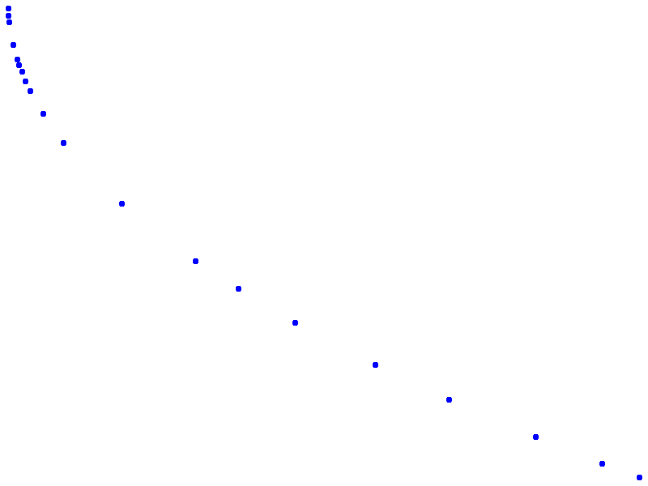
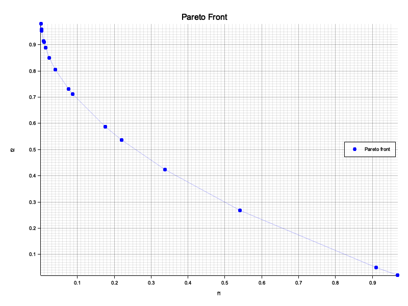
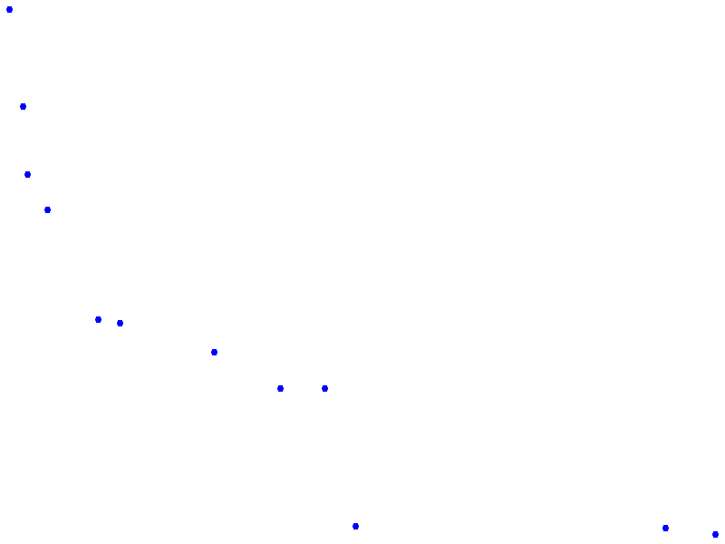
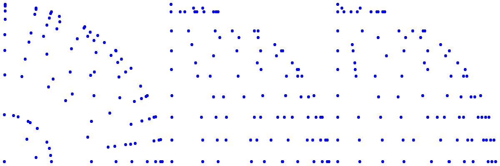
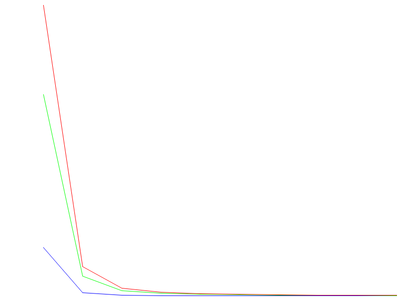

<!-- generated-by: gsd-doc-writer -->
# genetic_algorithms (v3.0.0)

> **v3.0.0 users:** see [MIGRATION.md](./MIGRATION.md) for the full list of breaking changes and migration recipes.

[](https://github.com/leimbernon/rust_genetic_algorithms/actions/workflows/rust-unit-tests.yml)

Modular and concurrent evolutionary computation library for Rust. Provides **17 optimization engines** — standard GA, multi-objective (NSGA-II/III, MOEA/D, SPEA2, SMS-EMOA, IBEA), island model, Differential Evolution, CMA-ES (with IPOP/BIPOP restarts), Particle Swarm Optimization, Estimation of Distribution (UMDA), Scatter Search, Cellular GA, ALPS, Hill Climbing, exhaustive Permutation search, and Genetic Programming (GP) — all generic over chromosome and gene types via traits.

Key capabilities:
- Clear abstractions: traits for genes, chromosomes, and configuration.
- Composable operators: selection, crossover, mutation, survivor, extension.
- Multi-threaded execution via `rayon` (fitness evaluation, reproduction, mutation in parallel).
- Adaptive GA mode: dynamic crossover and mutation probabilities based on population performance.
- Elitism: preserve top N individuals across generations.
- Extension strategies for population diversity control (mass extinction, genesis, degeneration, deduplication).
- Variable-length chromosomes: `ChromosomeLength::Variable { min, max }` with `Mutation::Insertion` / `Mutation::Deletion` and `Crossover::VariableLength`.
- Parsimony pressure: length-penalized fitness during survivor selection via `with_length_penalty`.
- Genetic Programming engine (`GpGa`) with subtree crossover, subtree/point/hoist mutation, ramped half-and-half initialization, and built-in `MathNode` / `BoolNode` primitive sets.
- **CMA-ES (`CmaEngine`)** with Hansen-default parameter formulas, Jacobi eigendecomposition (no LAPACK, WASM-compatible), and `RestartStrategy::Ipop` / `Bipop` for multimodal landscapes.
- **PSO (`PsoEngine`)** with configurable inertia (Constant, LinearDecay, RandomRange), topology (Global, Ring, VonNeumann), and absorbing boundary handling.
- **EDA (`EdaEngine` / `EdaRealEngine`)** — UMDA Bernoulli and Gaussian probabilistic models; no crossover/mutation required.
- **Constraint handling (`ConstraintHandling`)** — Static / Dynamic / Adaptive / Death penalties and feasibility-rules support.
- **Hall of Fame (`HallOfFame`)** — bounded elite archive with deduplication and optional minimum-distance diversity (`DistanceMetric`).
- **Adaptive Operator Selection (`AosStrategy`)** — Probability Matching, Adaptive Pursuit, and Multi-Armed Bandit credit assignment.
- **Batch fitness (`BatchFitnessEvaluator`)** and **surrogate-assisted evaluation (`SurrogateModel`)** for expensive black-box objectives.
- **Memetic algorithms** via `LocalSearchOperator` (Lamarckian / Baldwinian modes).
- **Standard benchmark suite** (`benchmarks` feature): Sphere, Rastrigin, Ackley, ZDT1–6, DTLZ1–7 and multi-objective indicators (Hypervolume, GD, IGD, Spread).
- Lifecycle observer system (`GaObserver`, 13 hooks including `on_restart`) with built-in `LogObserver`, `CompositeObserver`, `MetricsObserver`, `TracingObserver`, `AllObserver`, and `NoopObserver`.
- Optional `visualization` feature for PNG/SVG fitness, diversity, and Pareto-front charts.
- `Cow<[Gene]>` for zero-copy DNA operations.
- Compound stopping criteria: stagnation, convergence threshold, time limit.
- First-class WebAssembly support (`wasm32-unknown-unknown` is a CI gate).

## Table of Contents
- [Documentation](#documentation)
- [Changelog](CHANGELOG.md)
- [Installation](#installation)
- [Quick Start](#quick-start)
- [Features](#features)
  - [Traits](#traits)
  - [Included Genotypes & Chromosomes](#included-genotypes--chromosomes)
  - [Initializers](#initializers)
  - [Operators](#operators)
  - [Engines](#engines)
  - [Observer (GaObserver)](#observer-gaobserver)
  - [Visualization](#visualization)
  - [GA Configuration](#ga-configuration)
  - [Adaptive GA](#adaptive-ga)
  - [Multithreading & Performance](#multithreading--performance)
- [WebAssembly](#webassembly)
- [Examples](#examples)
- [Development](#development)
- [License](#license)

## Documentation

- [docs/ directory](docs/index.md) — Per-engine algorithm guides, operator reference, and framework extension docs
- [docs.rs/genetic_algorithms](https://docs.rs/genetic_algorithms/latest/genetic_algorithms) — Full API reference with crate-level overview

## Installation

Add to your `Cargo.toml`:

```toml
[dependencies]
genetic_algorithms = "3.0.0"
```

Optional feature flags:

```toml
# PNG/SVG fitness and diversity charts
genetic_algorithms = { version = "3.0.0", features = ["visualization"] }

# Checkpoint serialization (serde/serde_json) — includes stack-safe GP tree serialization
genetic_algorithms = { version = "3.0.0", features = ["serde"] }

# Standard benchmark functions (Sphere, Rastrigin, Rosenbrock, ZDT, DTLZ) and quality indicators
genetic_algorithms = { version = "3.0.0", features = ["benchmarks"] }

# Observer integration with the `tracing` crate
genetic_algorithms = { version = "3.0.0", features = ["observer-tracing"] }

# Observer integration with the `metrics` crate
genetic_algorithms = { version = "3.0.0", features = ["observer-metrics"] }
```

To shed the `log` crate entirely for embedded / ultra-lean / wasm-only builds:

```toml
genetic_algorithms = { version = "3.0.0", default-features = false }
```

The `logging` feature is on by default. Disabling it removes the `log` dependency and causes all internal log emissions to expand to `()` at compile time. `LogObserver` is also unavailable without this feature.

The `parallel` feature is also on by default. Disable via `default-features = false` to shed the `rayon` + `crossbeam` dependencies for embedded / wasm-only builds:

```toml
# Disable rayon for wasm-only or embedded builds
genetic_algorithms = { version = "3.0.0", default-features = false, features = ["logging"] }
```

| Feature | Description | Default |
|---------|-------------|---------|
| `logging` | `log` crate events via `LogObserver` | **On** |
| `parallel` | Parallel fitness evaluation via rayon (default-on; disable to shed rayon + crossbeam dependencies for embedded / wasm-only builds) | **On** |

## Quick Start

Minimal GA using `Range<f64>` chromosomes, minimizing the Rastrigin function:

```rust
use genetic_algorithms::chromosomes::Range as RangeChromosome;
use genetic_algorithms::configuration::ProblemSolving;
use genetic_algorithms::ga::Ga;
use genetic_algorithms::genotypes::Range as RangeGenotype;
use genetic_algorithms::initializers::range_random_initialization;
use genetic_algorithms::operations::{Crossover, Mutation, Selection, Survivor};
use genetic_algorithms::traits::{ConfigurationT, CrossoverConfig, MutationConfig, SelectionConfig, StoppingConfig};
use genetic_algorithms::{CompositeObserver, LogObserver};
use std::sync::Arc;

let fitness_fn = |dna: &[RangeGenotype<f64>]| -> f64 {
    let a = 10.0;
    let n = dna.len() as f64;
    a * n + dna.iter().map(|g| g.value.powi(2) - a * (2.0 * std::f64::consts::PI * g.value).cos()).sum::<f64>()
};

let alleles = vec![RangeGenotype::new(0, vec![(-5.12, 5.12)], 0.0_f64)];
let alleles_clone = alleles.clone();

let mut ga = Ga::new()
    .with_genes_per_chromosome(5_usize)
    .with_population_size(100)
    .with_initialization_fn(move |genes_per_chromosome, _, _| {
        range_random_initialization(genes_per_chromosome, Some(&alleles_clone), Some(false))
    })
    .with_fitness_fn(fitness_fn)
    .with_selection_method(Selection::Tournament)
    .with_crossover_method(Crossover::Uniform)
    .with_mutation_method(Mutation::Gaussian)
    .with_survivor_method(Survivor::Fitness)
    .with_problem_solving(ProblemSolving::Minimization)
    .with_max_generations(500)
    .with_observer(Arc::new(CompositeObserver::new().add(Arc::new(LogObserver))))
    .build()
    .expect("Invalid configuration");

let population = ga.run().expect("GA run failed");
println!("Best fitness: {:.4}", population.best_chromosome.fitness);
```

## Features

### Traits

- **`GeneT`** — Requires `Default + Clone + Send + Sync`. Key methods: `new()`, `get_id() -> i32`, `set_id(i32)`.
- **`ChromosomeT`** — Associated `type Gene: GeneT`. Supports `get_dna()`, `set_dna(Cow<[Gene]>)`, `set_gene(idx, gene)`, `set_fitness_fn(...)`, `calculate_fitness()`, `get_fitness()`, `set_fitness(f64)`, `get_age()`, `set_age(i32)`. Derived metric: `get_fitness_distance(&fitness_target)`.
- **`ConfigurationT`** — Builder-style API for `Ga` and all engine configuration structs.

### Included Genotypes & Chromosomes

- `genotypes::Binary` — boolean gene.
- `genotypes::Range<T>` — values constrained to one or more `(min, max)` intervals.
- `genotypes::List<T>` — values drawn from a finite symbolic alphabet.
- `chromosomes::Binary` — chromosome built from `Binary` genes.
- `chromosomes::Range<T>` — chromosome built from `Range<T>` genes.
- `chromosomes::ListChromosome<T>` — chromosome built from `List<T>` genes.
- `chromosomes::ChromosomeLength` — `Fixed(usize)` or `Variable { min, max }` — controls length-changing operators.
- `gp::GpChromosome<N>` — tree chromosome for Genetic Programming (see [Genetic Programming](#genetic-programming-gpga)).

Custom chromosomes can be added by implementing `ChromosomeT`.

### Initializers

- `initializers::binary_random_initialization`
- `initializers::range_random_initialization`
- `initializers::list_random_initialization` (with repetition)
- `initializers::list_random_initialization_without_repetitions` (permutation problems)
- `initializers::generic_random_initialization` (allele slice, optional unique IDs)
- `initializers::generic_random_initialization_without_repetitions`

### Operators

- **Selection:** `Random`, `RouletteWheel`, `StochasticUniversalSampling`, `Tournament`, `Rank`, `Boltzmann`, `Truncation`, `Clearing`, `Lexicase`, `EpsilonLexicase`
- **Crossover:** `Cycle`, `MultiPoint`, `Uniform`, `SinglePoint`, `Order` (OX), `Pmx` (Partially Mapped), `Sbx` (Simulated Binary), `BlendAlpha` (BLX-α), `Arithmetic`, `Clone`, `Rejuvenate`, `EdgeRecombination`, `VariableLength(AlignmentStrategy)` (for variable-length chromosomes), `Undx`, `Spx`, `Pcx` (multi-parent real-valued crossover via the `RealValued` marker trait)
- **Mutation:** `Swap`, `Inversion`, `Scramble`, `Value` (Range<T>), `BitFlip` (Binary), `Creep` (uniform perturbation), `Gaussian` (normal perturbation), `Polynomial` (NSGA-II style), `NonUniform` (decreasing magnitude), `PermutationInsert` (permutation move), `Insertion` (grow variable-length chromosome), `Deletion` (shrink variable-length chromosome), `Cauchy`, `LevyFlight`, `Uniform`, `ListValue` (List<T>), `Differential`, `SelfAdaptiveGaussian` (log-normal sigma update, requires `SelfAdaptive` chromosome)
- **Survivor:** `Fitness` (keep best), `Age` (prefer younger), `MuPlusLambda` (parents + offspring compete), `MuCommaLambda` (offspring only), `DeterministicCrowding`; parsimony pressure via `with_length_penalty`
- **Extension:** `Noop`, `MassExtinction`, `MassGenesis`, `MassDegeneration`, `MassDeduplication`

### Engines

| Engine | Module | Objectives | Description |
|--------|--------|------------|-------------|
| `Ga<U>` | `ga` | Single | Standard single-population GA with full operator support, adaptive mode, elitism, and extensions |
| `IslandGa<U>` | `island` | Single | Island model with configurable migration topology, frequency, and migrant selection |
| `DeEngine<U>` | `de` | Single | Differential Evolution — 5 mutation strategies + JADE/L-SHADE adaptive variants |
| `CmaEngine<U>` | `cma` | Single | Covariance Matrix Adaptation Evolution Strategy (CMA-ES); Hansen-default formulas; `RestartStrategy::Ipop` / `Bipop` for multimodal landscapes |
| `PsoEngine<U>` | `pso` | Single | Particle Swarm Optimization — configurable inertia (`PsoInertia`), topology (`PsoTopology`), absorbing boundary |
| `EdaEngine<U>` / `EdaRealEngine<U>` | `eda` | Single | UMDA: Bernoulli model for binary problems, Gaussian model for continuous — no crossover/mutation |
| `ScatterEngine<U>` | `scatter` | Single | Scatter Search with reference set diversification and combination methods |
| `CellularEngine<U>` | `cellular` | Single | Cellular GA on a 2D toroidal grid with 4 neighborhood topologies |
| `AlpsEngine<U>` | `alps` | Single | Age-Layered Population Structure with 3 age schemes and cross-layer mating |
| `HillClimbEngine<U>` | `hill_climb` | Single | Local-search baseline strategy — `Stochastic` or `SteepestAscent` mode |
| `PermutateEngine<U>` | `permutate` | Single | Exhaustive enumeration over a permutation space with a hard safety gate against combinatorial explosion |
| `GpGa<N>` | `gp` | Single | Genetic Programming — tree chromosomes, subtree/point/hoist mutation, ramped half-and-half initialization |
| `Nsga2Ga<U>` | `nsga2` | 2+ | NSGA-II — fast non-dominated sorting with crowding distance diversity |
| `Nsga3Ga<U>` | `nsga3` | 3+ | NSGA-III — reference-point based selection for many-objective problems |
| `MoeaDGa<U>` | `moead` | 2+ | MOEA/D — decomposition-based scalarization (Tchebycheff, PBI, weighted sum) |
| `Spea2Ga<U>` | `spea2` | 2+ | SPEA2 — strength-Pareto archive with k-nearest density estimation |
| `SmsEmoaGa<U>` / `IbeaGa<U>` | `sms_emoa`/`ibea` | 2+ | Hypervolume contribution / indicator-based MOEAs |

### Variable-Length Chromosomes

Set `ChromosomeLength::Variable { min, max }` on the mutation configuration to enable chromosomes whose length can change during evolution.

```rust
use genetic_algorithms::chromosomes::ChromosomeLength;
use genetic_algorithms::operations::Mutation;
use genetic_algorithms::traits::MutationConfig;

// Enable length-changing mutations (grow or shrink by 1 gene per application).
let mut ga = Ga::new()
    .with_mutation_method(Mutation::Insertion)          // grow by 1
    // or .with_mutation_method(Mutation::Deletion)     // shrink by 1
    .with_chromosome_length(ChromosomeLength::Variable { min: 2, max: 20 })
    // Optional: penalize longer chromosomes during survivor selection.
    .with_length_penalty(0.01)
    // ... rest of configuration
    .build()
    .expect("valid config");
```

For variable-length parents use `Crossover::VariableLength(AlignmentStrategy)`:

```rust
use genetic_algorithms::operations::{Crossover, AlignmentStrategy};

// Trim both parents to min(len_a, len_b) before single-point crossover.
.with_crossover_method(Crossover::VariableLength(AlignmentStrategy::Trim))

// Pad the shorter parent (from its alleles) to max(len_a, len_b).
.with_crossover_method(Crossover::VariableLength(AlignmentStrategy::Pad))
```

### Genetic Programming (GpGa)

`GpGa<N>` evolves tree-structured chromosomes (`GpChromosome<N>`). Implement `GpNode` on your own enum to define the function and terminal set.

```rust
use genetic_algorithms::gp::{GpConfiguration, GpGa, GpMutation, MathNode};

let config = GpConfiguration::new()
    .with_population_size(100)
    .with_max_generations(50)
    .with_init_max_depth(4)
    .with_max_depth(8)
    .with_max_node_count(200)
    .with_mutations(vec![
        (GpMutation::SubtreeMutation { mutation_max_depth: 4 }, 0.1),
        (GpMutation::PointMutation { p_per_node: 0.05 }, 0.1),
    ]);

// GpGa::with_ramped_half_and_half uses the built-in initializer automatically.
let mut engine = GpGa::<MathNode>::with_ramped_half_and_half(config, |tree| {
    // Evaluate the expression tree — return a fitness value.
    // Use Node::<MathNode>::eval_with_vars(tree, &[x0, x1]) for variable injection.
    0.0
});
let result = engine.run().unwrap();
println!("Best fitness: {}", result.best_fitness);
println!("Best program: {}", result.best); // Prints Lisp S-expression
```

Built-in primitive sets:
- `MathNode` — `Add`, `Sub`, `Mul`, `ProtectedDiv`, `Const(f64)` (ERC), `Var(usize)` — for symbolic regression.
- `BoolNode` — `And`, `Or`, `Not`, `Gt`, `Lt` — for classification tree learning.

GP mutation operators:

| Variant | Description |
|---------|-------------|
| `GpMutation::SubtreeMutation { mutation_max_depth }` | Replaces a random subtree with a freshly grown random tree |
| `GpMutation::PointMutation { p_per_node }` | Replaces each node's primitive with a same-arity alternative |
| `GpMutation::HoistMutation` | Replaces a subtree with one of its own descendants (always shrinks) |

### Observer (GaObserver)

> **v3.0.0:** the legacy `Reporter<U>` trait has been removed. Use `GaObserver` instead — see [MIGRATION.md](./MIGRATION.md).

Attach a lifecycle observer via `.with_observer(Arc::new(my_observer))`. All hooks take `&self` — safe in rayon parallel regions. Zero overhead when no observer is attached (stored as `Option<Arc<_>>`).

#### Core trait: `GaObserver<U>`

| Hook | When it fires |
|------|--------------|
| `on_run_start` | Before the first generation |
| `on_generation_start` | At the start of each generation |
| `on_selection_complete` | After parent selection |
| `on_crossover_complete` | After crossover batch |
| `on_mutation_complete` | After mutation batch |
| `on_fitness_evaluation_complete` | After fitness re-evaluation |
| `on_survivor_selection_complete` | After survivor selection |
| `on_new_best` | When a new best chromosome is found |
| `on_stagnation` | When no improvement for N generations |
| `on_extension_triggered` | When diversity extension fires |
| `on_restart` | When `CmaEngine` triggers an IPOP/BIPOP restart (`RestartEvent`) |
| `on_generation_end` | End of each generation (with `GenerationStats`) |
| `on_run_end` | After the last generation |

#### Engine-specific sub-traits

- `IslandGaObserver<U>` — additional hooks for island migration events; attach via `island::IslandGa::with_observer`.
- `Nsga2Observer<U>` — additional hooks for NSGA-II pareto-front and crowding events; attach via `nsga2::Nsga2::with_observer`.
- `Nsga3Observer<U>` — additional hooks for NSGA-III reference-point and normalization events.
- `MoeaDObserver<U>` — additional hooks for MOEA/D subproblem and neighborhood updates.
- `Spea2Observer<U>` — additional hooks for SPEA2 archive and fitness assignment events.
- `SmsEmoaObserver<U>` — additional hooks for SMS-EMOA hypervolume contribution events.
- `IbeaObserver<U>` — additional hooks for IBEA indicator-based fitness events.

#### Built-in observers

**`LogObserver`** — logs every hook via the `log` crate. No feature flags required. Implements `GaObserver`, `IslandGaObserver`, and `Nsga2Observer`.

```rust
use std::sync::Arc;
use genetic_algorithms::{ga::Ga, LogObserver};

let mut ga = Ga::new()
    /* ...configuration... */
    .with_observer(Arc::new(LogObserver))
    .build()
    .expect("Invalid configuration");
```

**`CompositeObserver<U>`** — fan-out observer that forwards all hooks to a list of inner observers.

```rust
use std::sync::Arc;
use genetic_algorithms::{ga::Ga, CompositeObserver, LogObserver};

let composite = CompositeObserver::new()
    .add(Arc::new(LogObserver));

let mut ga = Ga::new()
    /* ...configuration... */
    .with_observer(Arc::new(composite))
    .build()
    .expect("Invalid configuration");
```

**`MetricsObserver`** — emits `metrics`-crate gauges, counters, and histograms per generation. Requires `observer-metrics` feature.

Emitted metrics: `ga.generation.best_fitness`, `ga.generation.mean_fitness`, `ga.generation.diversity`, `ga.operator.*_ms` histograms, `ga.event.new_best` / `ga.event.stagnation` / `ga.event.extension_triggered` counters.

**`TracingObserver`** — emits `tracing`-crate spans and events. Requires `observer-tracing` feature.

**`NoopObserver`** — satisfies the `GaObserver` bound with no-op implementations. Useful for testing or disabling observers at compile time.

**`AllObserver`** — implements `GaObserver`, `IslandGaObserver`, and `Nsga2Observer` with blanket coverage, so a single observer type can be used across all engine types.

#### Custom observer

Implement `GaObserver<U>` on your own type. All hooks have default no-op implementations — only override what you need:

```rust
use genetic_algorithms::{GaObserver, stats::GenerationStats};

struct MyObserver;

impl<U: genetic_algorithms::traits::ChromosomeT> GaObserver<U> for MyObserver {
    fn on_generation_end(&self, stats: &GenerationStats) {
        println!("Gen {} best={:.4}", stats.generation, stats.best_fitness);
    }
}
```

### Visualization

Requires the `visualization` feature. Three functions in `genetic_algorithms::visualization`:

```rust
// Fitness over generations (best, average, worst lines)
visualization::plot_fitness(&stats, "fitness.png")?;
visualization::plot_fitness(&stats, "fitness.svg")?;

// Diversity over generations
visualization::plot_diversity(&stats, "diversity.png")?;

// Fitness distribution for a generation
let fitness: Vec<f64> = population.iter().map(|c| c.get_fitness()).collect();
visualization::plot_histogram(&fitness, "distribution.png")?;
```

Format is determined by path extension (`.png` or `.svg`). All functions return `Result<(), VisualizationError>`.

#### Multi-Objective Pareto Fronts

| Algorithm | Benchmark | Plot |
|-----------|-----------|------|
| NSGA-II | ZDT1 (2-obj) |  |
| SPEA2 | ZDT1 (2-obj) |  |
| SMS-EMOA | ZDT1 (2-obj) |  |
| IBEA | ZDT1 (2-obj) |  |
| NSGA-III | DTLZ2 (3-obj, three-panel) |  |

Generate each plot by running the corresponding example with `--plot`, for example:

```bash
cargo run --example nsga2_zdt1 --features visualization -- --plot
cargo run --example sms_emoa_zdt1 --features "visualization,benchmarks" -- --plot
```

#### Single-Objective Fitness Progress



Generated via:

```bash
cargo run --example rastrigin --features visualization -- --plot
```

### GA Configuration

`GaConfiguration` (or the `Ga` builder) exposes:

- **Limits:** `problem_solving` (`Minimization | Maximization | FixedFitness`), `max_generations`, `fitness_target`, `population_size`, `genes_per_chromosome`, `needs_unique_ids`, `alleles_can_be_repeated`.
- **Selection:** `number_of_couples`, `method`.
- **Crossover:** `number_of_points` (MultiPoint), `probability_min` / `probability_max`, `method`, `sbx_eta`, `blend_alpha`, `arithmetic_alpha`.
- **Mutation:** `probability_min` / `probability_max`, `method`, `step` (Creep), `sigma` (Gaussian), `eta_m` (Polynomial), `non_uniform_b` (NonUniform).
- **Survivor:** `survivor`.
- **Elitism:** `elitism_count` — preserve the top N individuals unchanged across generations.
- **Extension:** configure via `with_extension_method()`, `with_extension_diversity_threshold()`, `with_extension_survival_rate()`, `with_extension_mutation_rounds()`, `with_extension_elite_count()`.
- **Stopping criteria:** `StoppingCriteria` with `stagnation_generations`, `convergence_threshold`, `max_duration_secs`. The GA stops when any enabled criterion is met.
- **Infra:** `adaptive_ga`, `number_of_threads`.

### Adaptive GA

When `adaptive_ga = true`:
- Crossover and mutation probabilities are recomputed per parent pair using relative fitness (`f_max`, `f_avg`).
- Both `probability_min` and `probability_max` must be set for crossover and mutation.

When `adaptive_ga = false`:
- If `probability_max` is absent, defaults to 1.0 (operator always applied).

### Multithreading & Performance

- `with_threads(n)` configures `rayon` parallelism.
- Selection, crossover, mutation, and fitness evaluation are parallelized each generation.
- `Cow<[Gene]>` prevents needless cloning of DNA vectors.
- `select_nth_unstable_by()` used over full sort when finding top-k individuals.

### Logging

The library emits structured `log!()` events (using the [`log`](https://crates.io/crates/log)
facade) but **does not install a logger**. Install your own subscriber in `main()`:

```rust
fn main() {
    env_logger::init(); // or: tracing_subscriber::fmt::init(), etc.

    let mut ga = Ga::new()
        // ... configure ...
        .build()
        .unwrap();
    ga.run().unwrap();
}
```

Control verbosity with `RUST_LOG`: `RUST_LOG=genetic_algorithms=warn cargo run`. The GA emits
events on the `ga_events`, `population_events`, and related log targets.

Add `env_logger` to your project's `[dev-dependencies]` for examples and tests:

```toml
[dev-dependencies]
env_logger = "0.11"
```

## WebAssembly

`genetic_algorithms` compiles for `wasm32-unknown-unknown` out of the box. No feature flags are required.

### Setup

The repository ships a `.cargo/config.toml` that automatically applies the necessary `rustflags` when targeting WASM, so no manual configuration is needed beyond adding the dependency normally:

```toml
[dependencies]
genetic_algorithms = "3.0.0"
```

Build with `wasm-pack` or directly with Cargo:

```bash
# Check WASM compilation
cargo check --target wasm32-unknown-unknown

# Build with wasm-pack (typical frontend workflow)
wasm-pack build --target web
```

If you are pulling `genetic_algorithms` as a dependency inside a WASM crate (without inheriting this repo's `.cargo/config.toml`), add the following to your own `.cargo/config.toml`:

```toml
[target.wasm32-unknown-unknown]
rustflags = ["--cfg", "getrandom_backend=\"wasm_js\""]
```

This is required because `getrandom 0.3` (a transitive dependency via `rand`) needs an explicit backend declaration for `wasm32-unknown-unknown` in addition to the `wasm_js` Cargo feature.

**Note on `GpGa`:** The GP engine is fully WASM-compatible. Fitness evaluation uses sequential iteration (`iter_mut`) instead of `par_iter_mut` on `wasm32-unknown-unknown`. Tree depth/size limits still apply.

### Known limitations on WASM

| Feature | Behaviour |
|---------|-----------|
| Parallelism (`rayon`) | Disabled — all parallel iterators fall back to sequential. Population evaluation is single-threaded on WASM. |
| Observer timing | `Instant`-based duration measurements are omitted (gated with `#[cfg(not(target_arch = "wasm32"))]`). Observer hooks still fire; only elapsed-time fields are absent. |
| `max_duration_secs` stopping criterion | The wall-clock check is skipped on WASM. Use `max_generations` or `fitness_target` as stopping criteria instead. |

## Examples

Run any example directly with `cargo run --example <name>`:

| Example | Domain | Command |
|---------|--------|---------|
| `rastrigin` | Continuous optimization | `cargo run --example rastrigin` |
| `nsga2_zdt1` | Multi-objective (NSGA-II) | `cargo run --example nsga2_zdt1` |
| `island_model` | Parallel / island model | `cargo run --example island_model` |
| `job_scheduling` | Permutation / scheduling | `cargo run --example job_scheduling` |
| `feature_selection` | Binary / adaptive GA | `cargo run --example feature_selection` |
| `niching` | Multimodal / niching | `cargo run --example niching` |
| `knapsack_binary` | Binary / combinatorial | `cargo run --example knapsack_binary` |
| `nqueens_range` | Constraint satisfaction | `cargo run --example nqueens_range` |
| `onemax_binary` | Binary / baseline | `cargo run --example onemax_binary` |
| `onemax_extension` | Binary / diversity control | `cargo run --example onemax_extension` |
| `nsga3_dtlz2` | Many-objective (NSGA-III) | `cargo run --example nsga3_dtlz2` |
| `moead_dtlz2` | Decomposition (MOEA/D) | `cargo run --example moead_dtlz2` |
| `spea2_zdt1` | Strength Pareto (SPEA2) | `cargo run --example spea2_zdt1` |
| `sms_emoa_zdt1` | Hypervolume-based (SMS-EMOA) | `cargo run --example sms_emoa_zdt1` |
| `ibea_zdt1` | Indicator-based (IBEA) | `cargo run --example ibea_zdt1` |
| `aos_demo` | Adaptive operator selection | `cargo run --example aos_demo` |
| `constrained_g1` | Constraint handling | `cargo run --example constrained_g1` |
| `hall_of_fame_demo` | Solution archive | `cargo run --example hall_of_fame_demo` |
| `memetic_rastrigin` | Memetic algorithm | `cargo run --example memetic_rastrigin` |
| `cma_es_rastrigin` | CMA-ES on Rastrigin | `cargo run --example cma_es_rastrigin` |
| `ipop_rastrigin` | CMA-ES + IPOP restarts | `cargo run --example ipop_rastrigin` |
| `pso_rastrigin` | Particle Swarm Optimization | `cargo run --example pso_rastrigin` |
| `eda_trap` | Estimation of Distribution (UMDA) | `cargo run --example eda_trap` |
| `surrogate_rastrigin` | Surrogate-assisted evaluation | `cargo run --example surrogate_rastrigin` |

## Development

### Prerequisites

- Rust `>= 1.81.0` (set in `Cargo.toml` `rust-version`)

### Build

```bash
cargo build            # Debug build
cargo build --release  # Optimized release build
```

### Run Tests

```bash
cargo test                              # Run all tests
cargo test --features serde             # Include serde tests
cargo test --features visualization     # Include visualization tests
cargo test -- --nocapture               # With visible stdout/stderr
```

### Run Benchmarks

Benchmarks use [Criterion](https://github.com/bheisler/criterion.rs) and are in `benches/`.

```bash
cargo bench                        # Run all benchmarks
cargo bench --bench crossover      # Run only crossover benchmarks
cargo bench --bench ga_run         # Run only GA run benchmarks
cargo bench --bench nsga2          # Run NSGA-II benchmarks
cargo bench --bench island_ga      # Run island model benchmarks
cargo bench --bench de             # Run Differential Evolution benchmarks
cargo bench --bench scatter        # Run Scatter Search benchmarks
cargo bench --bench alps           # Run ALPS benchmarks
cargo bench --bench cellular       # Run Cellular GA benchmarks
cargo bench --no-run               # Compile only (useful in CI)
```

Reports are generated in `target/criterion/` and can be viewed in a browser.

### Code Quality

```bash
cargo fmt --check   # Check formatting (no changes)
cargo fmt           # Auto-format
cargo clippy        # Run linter
cargo doc --no-deps # Generate documentation
```

See [CONTRIBUTING.md](CONTRIBUTING.md) for guidelines.

## License

Apache-2.0. See [LICENSE](LICENSE).
