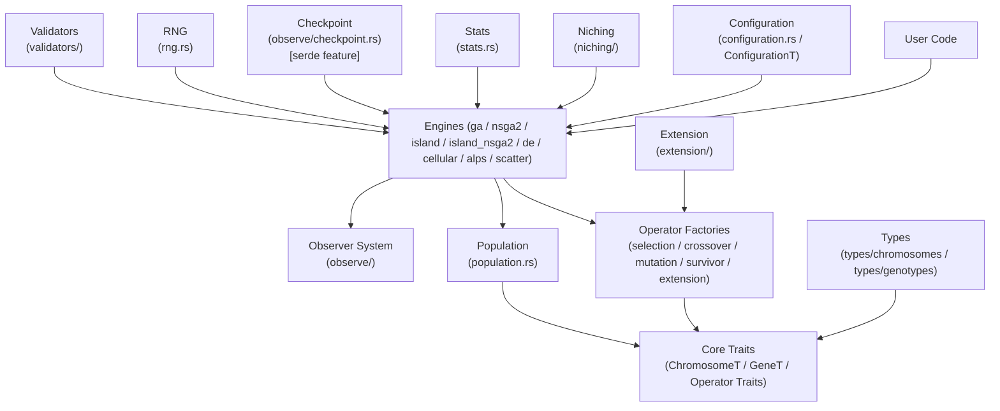

<!-- generated-by: gsd-doc-writer -->
# Architecture

## System Overview

`genetic_algorithms` is a Rust library for evolutionary computation. It exposes a single-objective GA (`Ga<U>`), a multi-objective engine (NSGA-II via `Nsga2Ga<U>`), and five alternative population models — Island Model, Island+NSGA-II, Differential Evolution, Cellular GA, and ALPS — plus a Scatter Search engine, all generic over user-defined chromosome and gene types. The library's primary inputs are a fitness function and an initialization function; its primary output is a `Population<U>` containing the best individuals found across all generations. The architecture follows a layered style: core traits at the bottom, operator implementations in the middle, and engine orchestrators at the top.

## Component Diagram



## Data Flow

A typical single-objective run follows this path:

1. The caller constructs a `Ga<U>` via the `ConfigurationT` fluent builder, supplying an initialization function and a fitness function.
2. `Ga::run()` delegates to `Ga::run_with_callback()`, which first calls `validators::validator_factory` to reject invalid configuration early.
3. If the population is empty, the initialization function is called to generate the initial `Vec<U>` of chromosomes. The optional RNG seed (`rng.rs`) is applied before any random operation.
4. Initial fitness is calculated in parallel via `rayon` using the installed fitness function.
5. For each generation the following steps execute in order:
   1. **Selection** — `selection::factory()` picks parent pairs using the configured `Selection` variant.
   2. **Crossover + Mutation** — `parent_crossover()` applies `crossover::factory()` and `mutation::factory_with_params()` in parallel via rayon, producing offspring.
   3. **Population merge** — offspring are appended to the parent population.
   4. **Elitism** — the top-N elite individuals are extracted before survivor selection.
   5. **Survivor selection** — `survivor::factory()` trims the merged population back to the configured size.
   6. **Elitism reinsertion** — elite individuals replace the worst survivors.
   7. **Adaptive GA** — crossover and mutation probabilities are recalculated if `adaptive_ga` is enabled.
   8. **Niching** — fitness sharing is applied if `NichingConfiguration` is present and enabled.
   9. **Best chromosome update** — a linear scan over fitness values updates `Population::best_chromosome`.
   10. **Statistics** — `GenerationStats::from_fitness_values()` captures best, worst, avg, std_dev, and diversity.
   11. **Dynamic mutation** — mutation probability is adjusted based on population diversity if enabled.
   12. **Extension** — if diversity falls below the threshold, `extension::factory()` fires (MassExtinction, MassGenesis, etc.) and an `ExtensionEvent` is sent to the observer.
   13. **Observer hooks** — `GaObserver` hooks fire at each stage (selection, crossover, mutation, fitness, survivor, generation-end).
   14. **Checkpoint** — if `save_progress` is enabled and the `serde` feature is active, a snapshot is serialised to disk.
   15. **Callback + stopping criteria** — the user callback is invoked periodically; stopping conditions (generation limit, fitness target, stagnation, convergence, time limit) are checked and may set a `TerminationCause`.

## Key Abstractions

| Abstraction | File | Description |
|-------------|------|-------------|
| `ChromosomeT` | `src/traits/chromosome.rs` | Core trait for any chromosome. Provides `dna()`, `dna_mut()`, `set_dna(Cow<[Gene]>)`, `fitness()`, `age()`, and `calculate_fitness()`. `Cow` enables zero-copy DNA moves. |
| `GeneT` | `src/traits/gene.rs` | Minimal gene trait. Requires `id() -> i32` and `set_id()`. Bounds: `Default + Clone + Sync + Send`. |
| `SelectionOperator` | `src/traits/operators.rs` | `select(&[U], couples, threads) -> Vec<(usize, usize)>`. |
| `CrossoverOperator` | `src/traits/operators.rs` | `crossover(&U, &U) -> Result<Vec<U>, GaError>`. |
| `MutationOperator` | `src/traits/operators.rs` | `mutate(&mut U, step, sigma) -> Result<(), GaError>`. |
| `SurvivorOperator` | `src/traits/operators.rs` | `select_survivors(&mut Vec<U>, pop_size, limits) -> Result<(), GaError>`. |
| `ExtensionOperator` | `src/traits/operators.rs` | `apply_extension(&mut Vec<U>, pop_size, problem, config) -> Result<(), GaError>`. |
| `ConfigurationT` | `src/traits/configuration.rs` | Supertrait combining `SelectionConfig`, `CrossoverConfig`, `MutationConfig`, `StoppingConfig`, `NichingConfig`, `ElitismConfig`, `ExtensionConfig`. Implemented by all engine builders. |
| `GaObserver<U>` | `src/observe/observer/mod.rs` | Structured lifecycle observer with 12 hooks (run start/end, generation start/end, per-operator timing, new-best, stagnation, extension). Stored as `Arc<dyn GaObserver + Send + Sync>`. |
| `GaError` | `src/error.rs` | Unified error enum returned by all fallible operations. |
| `GenerationStats` | `src/stats.rs` | Per-generation fitness metrics (best, worst, avg, std_dev, diversity, dynamic_mutation_probability). |

## Operator Dispatch Pattern

Every operator category follows the same **enum + factory function** pattern to provide runtime dispatch without vtable overhead in the common case:

```rust
// Caller configures via enum variant
.with_selection_method(Selection::Tournament)

// Engine dispatches to a concrete impl
let parents = selection::factory(
    &population.chromosomes,
    configuration.selection_configuration,
    number_of_threads,
)?;
```

The concrete operator structs live in `src/operations/<type>/` subdirectories. Custom operators can be implemented by providing a type that satisfies the corresponding `*Operator` trait; the engine accepts them via the `with_*_fn` builder overrides where available.

## Engines

| Engine | Module | Description |
|--------|--------|-------------|
| `Ga<U>` | `src/engines/ga.rs` | Single-population single-objective GA. The primary entry point. |
| `Nsga2Ga<U>` | `src/engines/nsga2/` | NSGA-II for multi-objective optimization. Uses `ParetoIndividual<U>` wrapper, non-dominated sorting, and crowding-distance survivor selection. |
| `IslandGa<U>` | `src/engines/island/` | Island model: N independent `Ga` populations evolve in parallel via rayon with periodic migration. Topology is configurable (ring, fully connected, etc.). |
| `IslandNsga2Ga<U>` | `src/engines/island/nsga2.rs` | Island Model + NSGA-II: N independent NSGA-II populations with periodic Pareto-aware migration. Returns the global Pareto front. |
| `DeEngine<U>` | `src/engines/de/` | Differential Evolution with 5 mutation strategies (`DE/rand/1`, etc.), 2 crossover modes (binomial/exponential), and JADE/L-SHADE adaptive parameter control. |
| `CellularEngine<U>` | `src/engines/cellular/` | Cellular GA: individuals placed on a 2-D toroidal grid; evolution occurs through local neighbourhood interactions. |
| `AlpsEngine<U>` | `src/engines/alps/` | Age-Layered Population Structure: population stratified into age layers with 3 age schemes, cross-layer mating, and periodic injection of fresh individuals into the youngest layer. |
| `ScatterEngine<U>` | `src/engines/scatter/` | Scatter Search: maintains a small reference set of high-quality and diverse solutions; generates candidates by linear combination and optional local search. |

## Observer System

The `GaObserver<U>` trait (`src/observe/observer/mod.rs`) is the preferred observability mechanism. Observers are attached to engines as `Arc<dyn GaObserver<U> + Send + Sync>`, enabling safe sharing across rayon island threads.

The 12 hooks on the base `GaObserver<U>` trait are:

| Hook | When it fires |
|------|--------------|
| `on_run_start` | Once before the first generation |
| `on_generation_start` | Start of each generation, before any operators |
| `on_selection_complete` | After parent selection |
| `on_crossover_complete` | After crossover produces offspring |
| `on_mutation_complete` | After mutation is applied |
| `on_fitness_evaluation_complete` | After fitness evaluation of new population |
| `on_survivor_selection_complete` | After survivor selection prunes population |
| `on_new_best` | When the population's best fitness improves |
| `on_stagnation` | Each time the stagnation counter increments |
| `on_extension_triggered` | When an extension strategy fires |
| `on_generation_end` | End of each generation, after statistics collected |
| `on_run_end` | Once after the GA loop exits |

Built-in observer implementations:

| Type | File | Description |
|------|------|-------------|
| `NoopObserver` | `src/observe/observer/mod.rs` | Zero-sized no-op. Zero overhead. |
| `LogObserver` | `src/observe/observer/log.rs` | Emits structured log output at each hook via the `log` crate. |
| `TracingObserver` | `src/observe/observer/tracing_observer.rs` | Emits `tracing` spans and events. Requires `observer-tracing` feature. |
| `MetricsObserver` | `src/observe/observer/metrics_observer.rs` | Records metrics via `metrics` crate. Requires `observer-metrics` feature. |
| `CompositeObserver` | `src/observe/observer/composite.rs` | Fans out to multiple `AllObserver` implementations. |

The engine-specific `IslandGaObserver<U>` and `Nsga2Observer<U>` traits extend the base set with engine-specific hooks (migration events, Pareto front assignments, crowding distance callbacks). The `AllObserver<U>` supertrait combines all three observer traits and is the bound used by `CompositeObserver`.

## Directory Structure

```
src/
├── engines/           # GA engine orchestrators
│   ├── ga.rs          # Single-objective GA (Ga<U>)
│   ├── nsga2/         # NSGA-II multi-objective engine
│   ├── island/        # Island model (multi-population + migration)
│   │   └── nsga2.rs   # Island + NSGA-II engine (IslandNsga2Ga<U>)
│   ├── de/            # Differential Evolution engine
│   ├── cellular/      # Cellular GA engine
│   ├── alps/          # Age-Layered Population Structure engine
│   └── scatter/       # Scatter Search engine
├── operations/        # Operator implementations and dispatch factories
│   ├── selection/     # Selection operator implementations
│   ├── crossover/     # Crossover operator implementations
│   ├── mutation/      # Mutation operator implementations
│   ├── survivor/      # Survivor selection implementations
│   └── extension/     # Extension strategy implementations
├── traits/            # Core trait definitions
│   ├── chromosome.rs  # ChromosomeT
│   ├── gene.rs        # GeneT
│   ├── operators.rs   # Operator traits
│   └── configuration.rs # ConfigurationT and sub-traits
├── types/             # Concrete chromosome and gene types
│   ├── chromosomes/   # Binary, Range<T>, List<T> chromosomes
│   └── genotypes/     # Binary, Range<T>, List<T> genes
├── observe/           # Observability subsystem
│   ├── observer/      # GaObserver trait + implementations
│   ├── reporter/      # Legacy Reporter trait (SimpleReporter, DurationReporter, NoopReporter)
│   ├── checkpoint.rs  # Serde-based checkpointing (serde feature)
│   └── visualization/ # Optional visualization (visualization feature)
├── niching/           # Fitness sharing (niching) implementation
├── extension/         # Extension configuration
├── configuration.rs   # GaConfiguration and sub-structs
├── population.rs      # Population<U> container and best-tracking
├── stats.rs           # GenerationStats
├── error.rs           # GaError enum
├── rng.rs             # Seedable RNG wrapper
├── initializers.rs    # Built-in initialization helpers (delegates to initializers/)
├── fitness.rs         # Fitness function wrapper types
└── validators/        # Configuration validation
```

Each engine owns its own `configuration.rs`; shared configuration lives in the top-level `src/configuration.rs`. Operator implementations are always isolated to their own file under `src/operations/<type>/` so that adding a new variant requires touching only the enum, the factory function, and the new implementation file.
